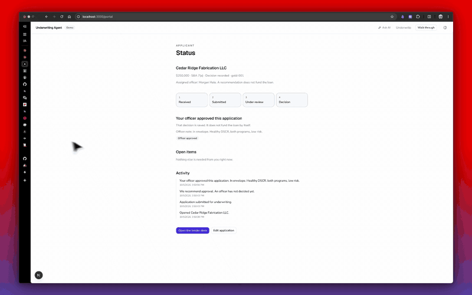

# Underwriting Decision & Escalation Agent

Agentic underwriting for SME loans: auto-decide inside a defined confidence and risk envelope, escalate everything else with a citation-grounded reasoning trace. A **hard-coded risk ceiling** in application code prevents any case above threshold from being auto-approved, regardless of model confidence.



The playground is two seats on one labeled file. An applicant fills `/apply` and watches `/portal`. An officer reviews the same case on `/playground/underwrite`, opens the cited clauses, and records approve / deny / escalate. **Walk through** on the landing page runs that loop on Cedar Ridge Fabrication (`gold-001`). Ask AI uses the same Policy RAG path as underwriting, in a sheet.

Applicants, policy files, and lender overlays in this repo are synthetic or local-only. Nothing here moves money or calls a credit bureau.

## Stack

| Layer | Choice |
|-------|--------|
| Orchestration | LangGraph (Python) |
| LLM | Claude (Sonnet) + thin OpenAI / DeepSeek fallback for RAG answers |
| Vector DB | pgvector on Postgres |
| API | FastAPI |
| MCP | FastMCP (stub tools under `src/mcp_server`) |
| Evals | DeepEval + Braintrust (+ RAGAS when importable) |
| Observability | Braintrust (evals) + LangSmith (LangGraph) + Prometheus / Grafana |
| Package / env | **uv** (`.venv`) |
| Web UI | Next.js + shadcn (`web/`) — apply, portal, officer desk, Ask AI |
| CI | GitHub Actions — pytest + false-approve hard gate |
| Metrics | `GET /metrics` (JSON) + `GET /prometheus` + Grafana on :3300 |

`agent` (the shared RAG pipeline) is installed from [`ai-engineering-boilerplate`](https://github.com/shadrach-tayo/ai-engineering-boilerplate) at the `eval` rev, which is MIT-licensed. `uv sync` clones that repo, so it has to stay publicly readable.

## Eval snapshot

Graph harness (`uv run underwriting-evals --mode graph --judge skip --fail-on-gate`), offline, no live retrieval:

| Metric | Result | Target |
|--------|--------|--------|
| **False-approve rate** | **0.0** | **0** (hard gate) |
| Decision accuracy | 1.0 | ≥ 0.9 |
| Program-routing accuracy | 1.0 | ≥ 0.9 |
| Escalation precision | 1.0 | ≥ 0.8 |
| Latency p95 | ~215 ms | < 5 s |

Citation and faithfulness need `--judge llm` against an ingested corpus (see [`EVALS.md`](./EVALS.md)). Ops notes: [`docs/RUNBOOK.md`](./docs/RUNBOOK.md).

## Layout

```text
src/
  graph/          # GraphState/SubagentState, nodes, hash-chained audit
  agents/         # Financial, Policy, Critic (SubagentOutput / CritiqueReport)
  mcp_server/     # FastMCP tools
  http_api/       # FastAPI health/ready, underwrite, admin RAG
  policy_rag/     # Policy corpus ingest + RagPipeline adapter (≠ dependency `rag`)
  evals/          # Eval suite
  models.py       # Citations, decisions, HITL, audit value objects
  config.py       # Settings incl. hard-coded risk ceiling
web/              # Next.js demo — apply, portal, officer desk, Ask AI
data/             # Local only (gitignored) — policy files, gold set, lenders
docs/             # System design, runbook, observability, demo.gif
prometheus/       # scrape config (profile: observability)
grafana/          # provisioned Underwriting API dashboard
terraform/        # AWS ECS + RDS (configured, not applied — demo is local)
tests/
.github/workflows/ci.yml
Dockerfile
```

## Setup

Requires [uv](https://docs.astral.sh/uv/) and Python 3.12+. Copy [`.env.example`](./.env.example) to `.env` and fill only the keys you need. `.env` is gitignored.

```bash
uv sync

# Gold set JSONL is local-only; regenerate if data/gold_set/applicants.jsonl is missing
uv run underwriting-gold-set

cp .env.example .env

# Postgres + pgvector for RAG (policy ingest / retrieve)
docker compose up -d postgres

uv run underwriting-agent
uv run pytest

# Eval hard gate (false-approve must stay 0)
uv run underwriting-evals --mode graph --judge skip --fail-on-gate

# After VOYAGE_API_KEY is set and Postgres is healthy:
# uv run underwriting-rag-ingest
# or via admin API:
# uv run underwriting-api
# curl -X POST http://127.0.0.1:8080/admin/rag/ingest -H 'Content-Type: application/json' -d '{}'
# curl http://127.0.0.1:8080/admin/rag/status

# Web demo (apply, portal, officer desk). Admin is opt-in via NEXT_PUBLIC_SHOW_ADMIN.
cd web && pnpm install && pnpm dev
```

Place your own policy files under `data/policy_sources/` before ingest. They are not in git. See [`data/README.md`](./data/README.md).

### API container

```bash
docker build -t underwriting-api .
docker run --rm -p 8080:8080 --env-file .env \
  -e API_HOST=0.0.0.0 -e API_RELOAD=false \
  -e POSTGRES_HOST=host.docker.internal -e POSTGRES_PORT=54326 \
  underwriting-api

# or compose profile (wires Postgres hostname automatically and mounts
# data/gold_set so the playground /gold-set catalog can load it):
docker compose --profile api up -d --build api

# Prometheus :9090 + Grafana :3300 (scrapes GET /prometheus).
# Local login is admin / admin. Do not publish ports 3300, 54326, or 8080.
docker compose --profile observability up -d

# Run api and observability stack
docker compose --profile api --profile observability up -d --build
```

Ops notes for traces vs scrapes: [`docs/OBSERVABILITY.md`](./docs/OBSERVABILITY.md).

### Local LangGraph + LangSmith

From the repo root (uses [`langgraph.json`](./langgraph.json)):

```bash
# Requires LANGSMITH_API_KEY in .env for Studio/tracing
uv run langgraph dev
```

This starts the LangGraph API server with hot reload (default `http://127.0.0.1:2024`) and opens LangGraph Studio. Traces land in the LangSmith project named by `LANGSMITH_PROJECT` (default `underwriting-agent`).

```bash
uv run langgraph validate   # check langgraph.json
uv run langgraph dev --no-browser
```

Graph ID: `underwriting` → `src/graph/__init__.py:graph`

`langchain-community` is pinned for RAGAS compatibility where needed. Revisit pins when upgrading evals.

## AWS (not deployed)

Terraform under [`terraform/`](./terraform/) describes ECS Fargate + RDS Postgres/pgvector + an ALB. **Do not apply it for the current demo** — run Postgres, the API, and the playground locally (see Setup). Grafana stays on compose profile `observability`.

## Hard-coded risk ceiling

`RISK_CEILING` (default `0.75`) is enforced in `graph.apply_risk_ceiling` — not in prompts. Cases at or above the ceiling always escalate.

## License

[MIT](./LICENSE). Copyright (c) 2026 Shadrach Oloyede.
